# Nexus ERP 使用说明书（用户版｜线上截图版）

> 面向业务用户：少术语、重流程、看图即可上手
>
> 截图环境：线上 `https://nexus-frontend-5thy.onrender.com`（demo）
>
> 日期：2026-03-04

## 1. 先了解系统主界面

登录后先看总览页，关注今日关键数据和待办。

---

## 2. 日常工作从哪里开始

## 2.1 工作区（文档协作）
用于记录会议纪要、工作笔记、团队文档。

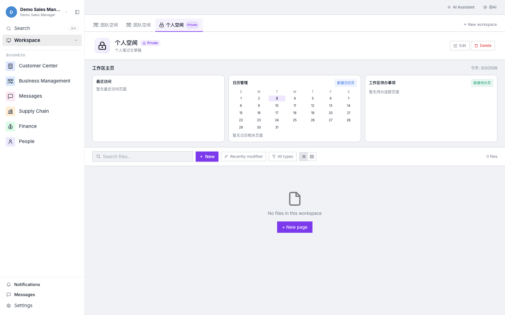

## 2.2 CRM（客户经营核心）
查看线索、客户、合同、应收应付等关键业务指标。

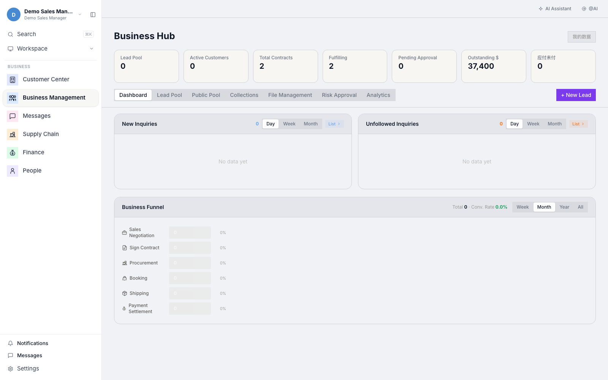

## 2.3 客户中心（客户资料沉淀）
管理客户列表、查看客户详情、持续补充客户资料。

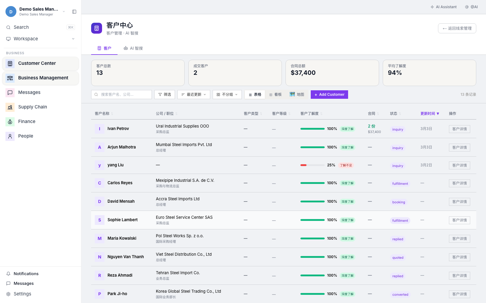

---

## 3. 沟通与协同怎么做

## 3.1 消息中心
统一处理 WhatsApp、邮件、内部消息，避免来回切软件。

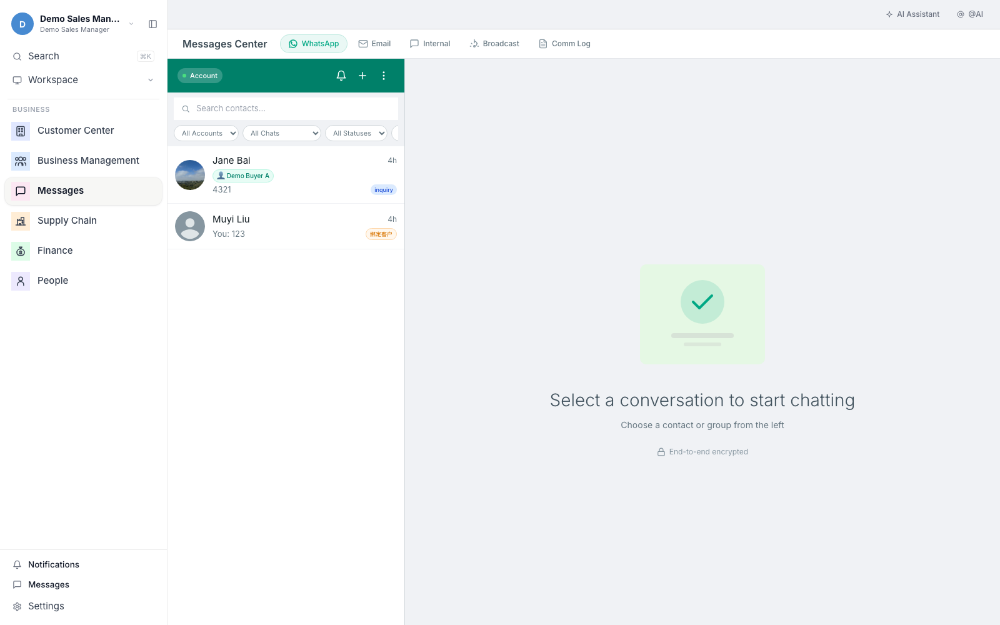

## 3.2 订单管理
跟踪订单执行进度，确保客户承诺按计划落地。

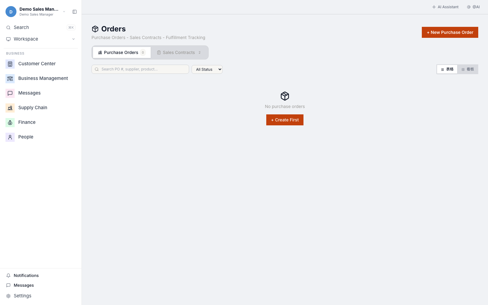

## 3.3 人事管理
维护员工信息，支持跨部门协同。

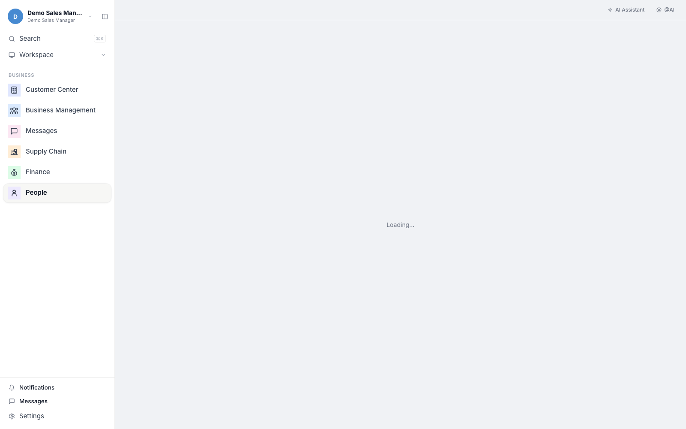

---

## 4. 经营数据与后台模块

## 4.1 财务管理
查看财务相关数据、应收应付状态。

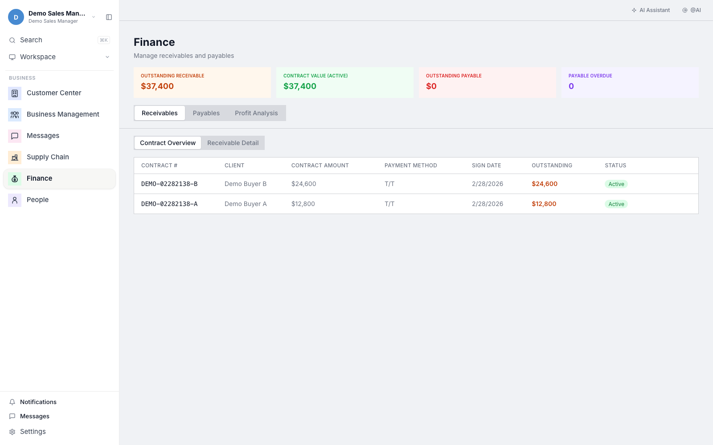

## 4.2 库存管理
查看库存分布和商品数据，辅助销售与交付决策。

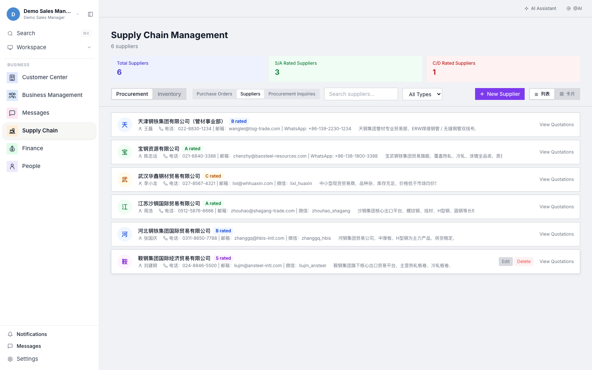

## 4.3 AI Finder
通过 AI 检索和分析业务信息，提高查询效率。

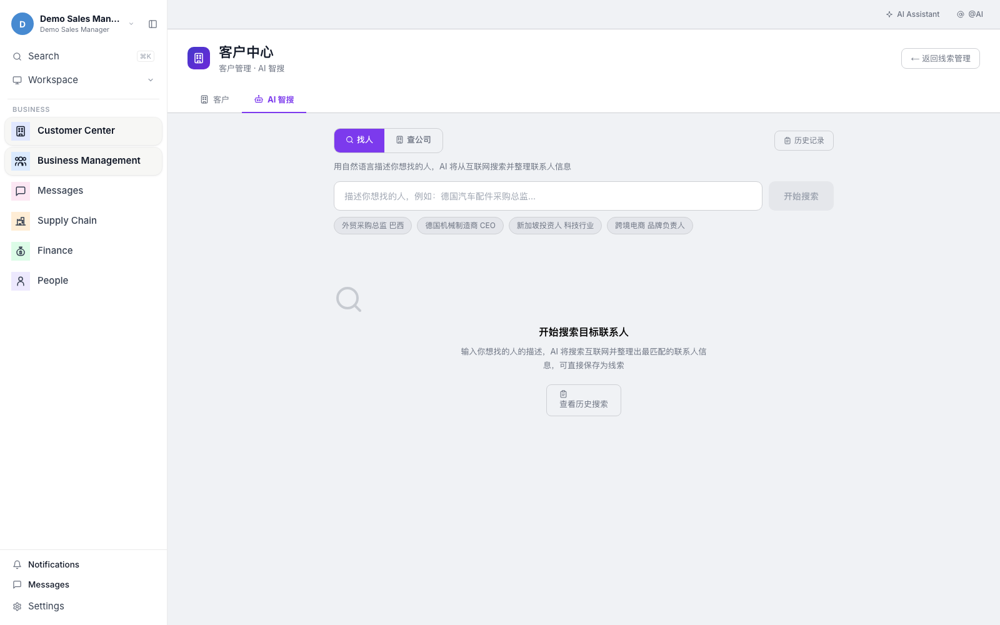

## 4.4 通知中心
统一查看系统通知与提醒，避免漏办事项。

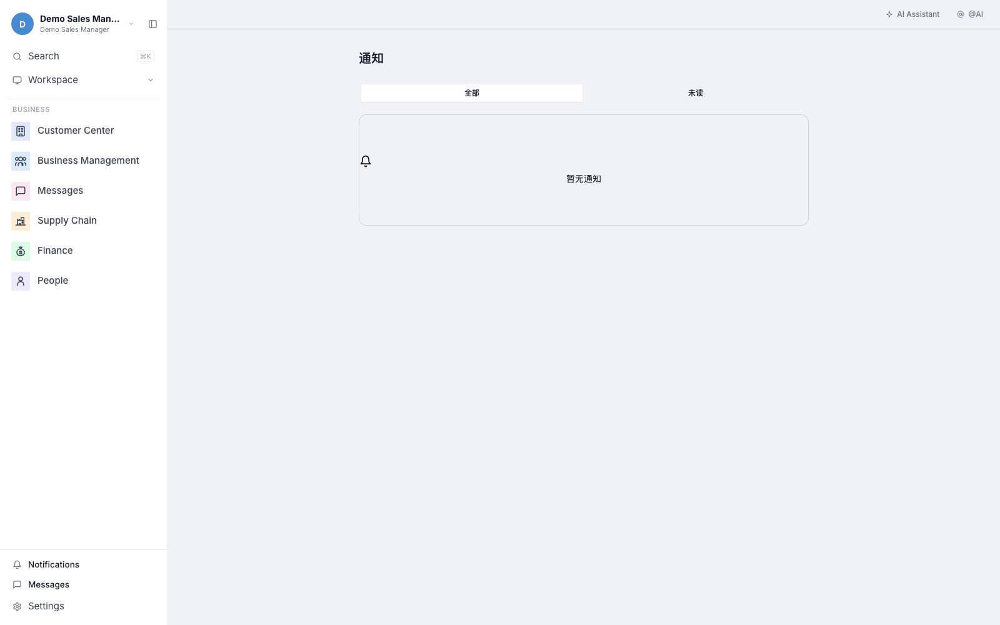

---

## 5. 系统设置与运营管理

## 5.1 设置中心
管理账号、外观、消息连接等基础配置。

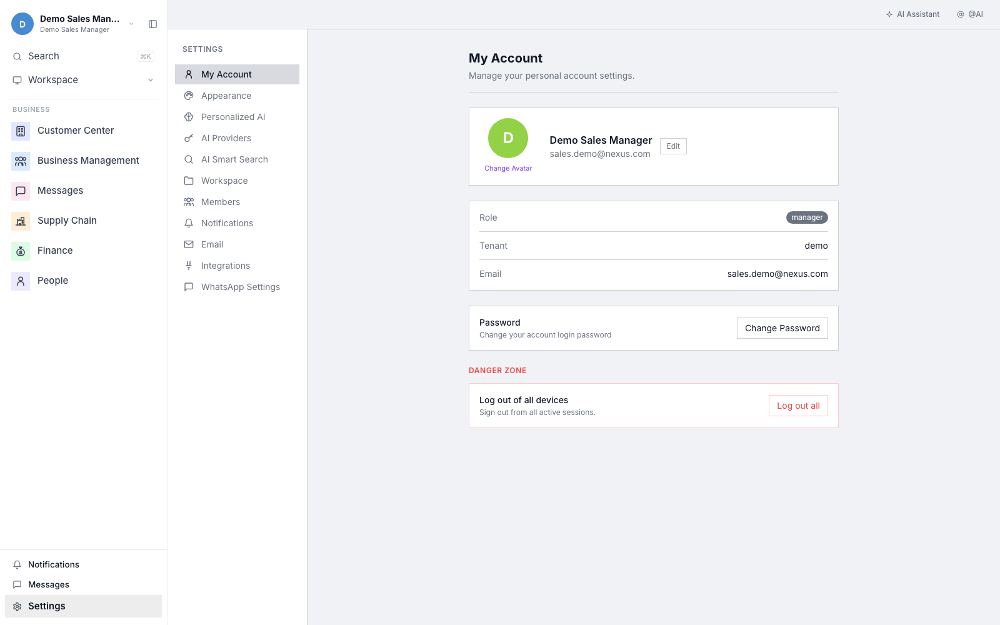

## 5.2 运营页面
用于业务运营流程的跟踪和管理。

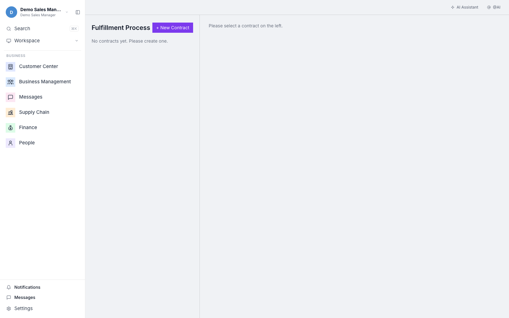

## 5.3 管理后台（管理员）
用于组织级配置、成员权限与系统管理。

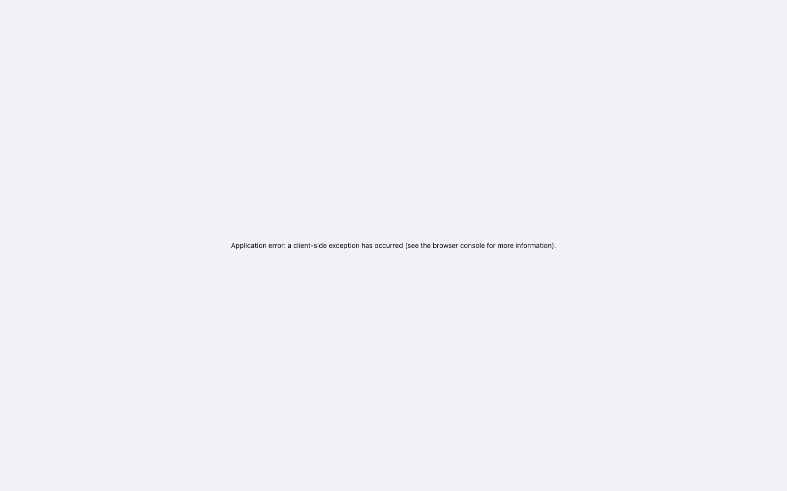

---

## 6. 推荐的上手顺序（给新用户）

1. 先看：总览首页（知道今天要干什么）
2. 再做：CRM 和客户中心（把客户信息沉淀好）
3. 每天用：消息中心（处理沟通，持续跟进）
4. 周复盘：订单 + 财务 + 库存（看交付与回款）
5. 管理员：设置中心 + 管理后台（管账号、权限、配置）

---

## 7. 常见问题

### Q1：我不是技术人员，能用吗？
可以。建议从 CRM、消息中心开始，用 2-3 天就能形成习惯。

### Q2：最容易出问题的是哪里？
不是系统本身，而是“跟进后不记录”。建议每次沟通后补一条记录。

### Q3：怎么判断团队有没有用好系统？
看三件事：
- 客户信息是否完整
- 沟通记录是否连续
- 重点客户是否按阶段推进

