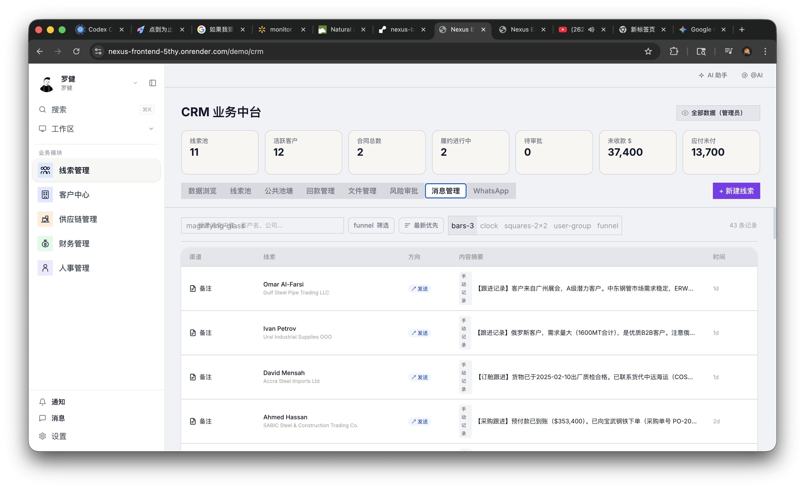
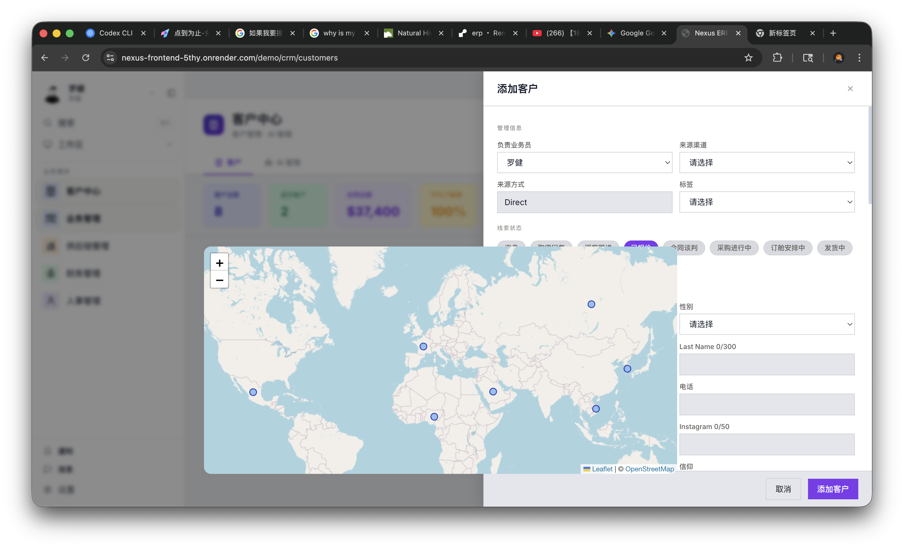
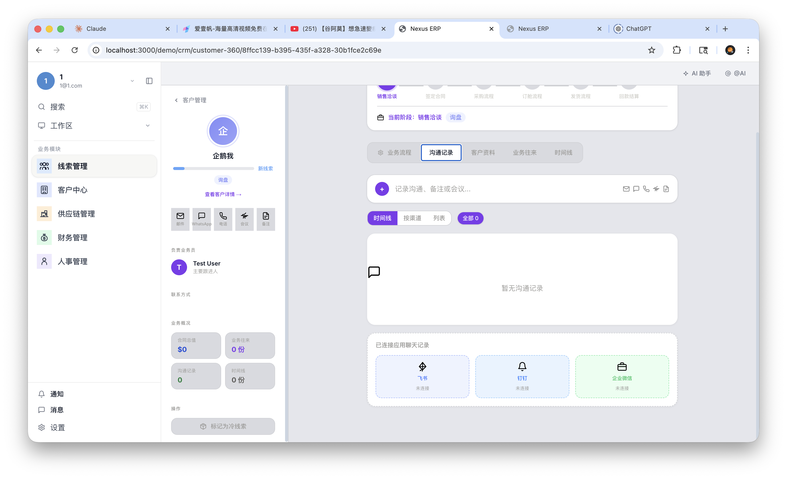
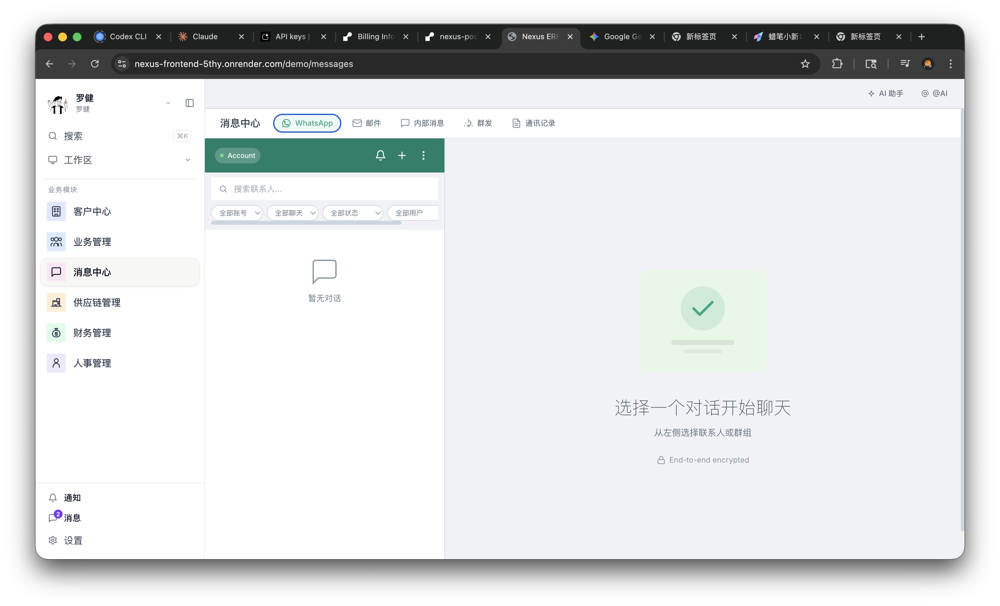
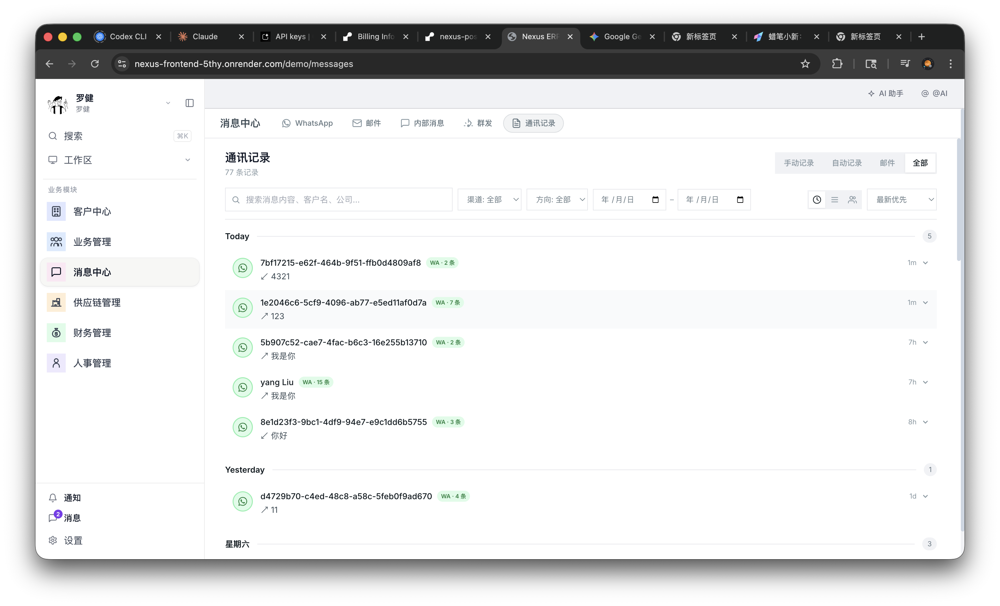
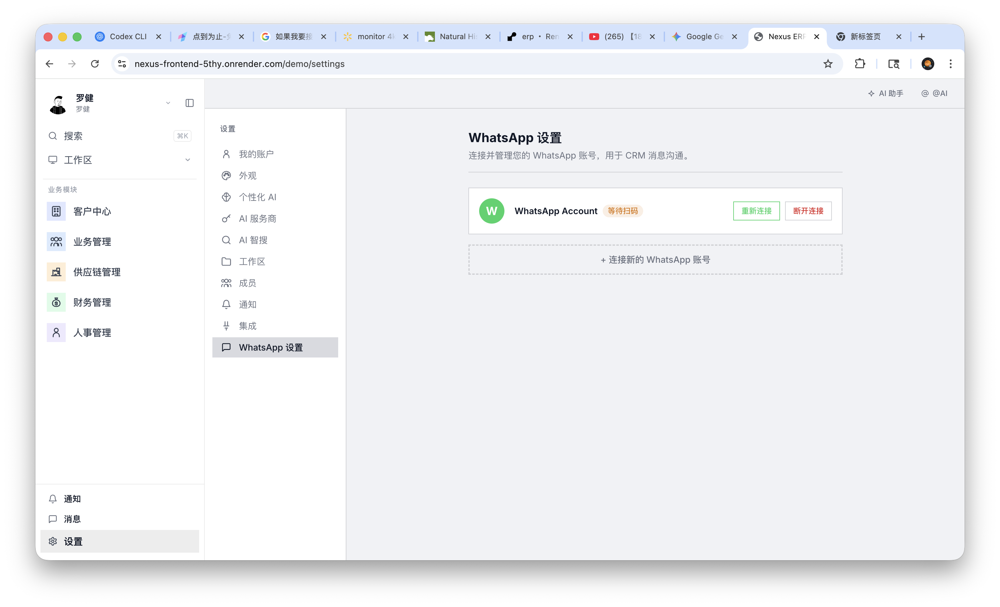
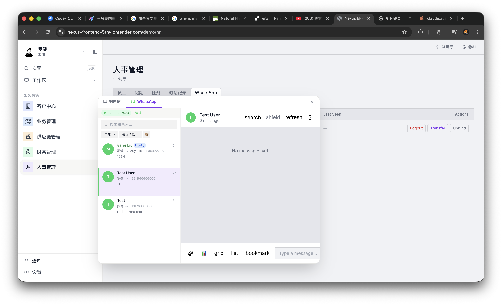

# Nexus ERP 使用说明书（用户版）

> 适用对象：销售、运营、管理者、实施同事（无技术背景也可直接使用）
>
> 版本日期：2026-03-04

## 1. 这套系统能帮你做什么

Nexus ERP 的目标很直接：
- 把客户信息、沟通记录、跟进进度放在同一个地方
- 让团队协作更顺，减少“找不到人/找不到记录”的情况
- 让管理层更快看到业务进展（线索、客户、合同、回款）

一句话：**从“到处找信息”变成“一个页面看全局”。**

---

## 2. 5 分钟快速上手

### 第一步：登录
1. 打开系统登录页。
2. 输入 Workspace（例如 `demo`）。
3. 输入账号密码，进入系统。

### 第二步：看业务总览
1. 左侧进入 `业务管理` 或 `客户中心`。
2. 先看顶部核心指标（线索、客户、合同、应收应付）。
3. 再看下方列表，找到你今天最需要跟进的人。

### 第三步：新增客户
1. 点击 `新增客户`。
2. 先填最关键信息：客户名、来源、联系人、电话/WhatsApp。
3. 其他信息（标签、销售阶段、备注）可以逐步补齐。

---

## 3. 常用业务流程（建议按这个顺序用）

## 流程 A：从线索到客户

1. 新增线索/客户。
2. 每次沟通后，补一条跟进记录（不要只留在聊天工具里）。
3. 当机会明确后，更新客户状态（例如：询盘中、谈判中、签约中）。
4. 进入客户 360 页面，集中管理该客户的全过程。

**这样做的好处：**
- 谁接手都能继续跟，不怕交接断档。
- 复盘时能看清楚“哪一步卡住了”。

---

## 流程 B：消息统一处理（非常关键）

1. 进入 `消息中心`。
2. 在顶部切换渠道：WhatsApp / 邮件 / 内部消息 / 通讯记录。
3. 先处理优先级高的会话，再处理普通会话。
4. 重要对话尽量关联到客户，后面追踪更容易。

### 查看历史沟通
1. 在 `通讯记录` 页签按时间、渠道、方向筛选。
2. 用于复盘：这个客户最近是否被跟进、谁在跟进、跟进效果如何。

---

## 流程 C：配置 WhatsApp 连接（管理员）

1. 进入 `设置`。
2. 打开 `WhatsApp 设置`。
3. 查看连接状态，必要时重连或断开。
4. 多账号团队可在这里新增账号。

**建议：**每天早上先看一次连接状态，避免沟通中断。

---

## 流程 D：跨部门协同（销售 + HR/运营）

在人事或其他模块，也可以直接打开沟通窗口，不需要反复切系统。

适用场景：
- 招聘沟通
- 入职协同
- 客户服务与内部协同并行处理

---

## 4. 每日操作清单（给一线同事）

每天上班建议按这 6 步：
1. 看今日核心指标变化（新增线索、待跟进客户）。
2. 打开消息中心，先处理高优先级会话。
3. 给重点客户补跟进记录。
4. 更新客户状态（确保“最新进展”真实可见）。
5. 检查当天待办（合同、回款、审批等）。
6. 下班前补齐备注，方便第二天接续。

---

## 5. 角色使用建议

### 销售
- 重点：新增客户、更新状态、记录沟通
- 目标：不丢线索、不丢上下文

### 销售负责人/经理
- 重点：看板、阶段分布、重点客户推进
- 目标：发现卡点，推动团队节奏

### 运营/客服
- 重点：消息中心与通讯记录
- 目标：保证响应速度与服务连续性

### 管理层
- 重点：核心指标和风险项（应收应付、关键客户进展）
- 目标：快速判断业务健康度

---

## 6. 常见问题（非技术版）

### Q1：信息要一次填完吗？
不需要。先填关键字段，后续跟进时逐步完善。

### Q2：为什么强调“每次沟通都要记录”？
因为系统价值就在“可追踪、可交接、可复盘”。不记录就等于回到原来分散状态。

### Q3：员工离职会不会影响客户跟进？
影响会大幅降低。因为客户资料和沟通过程都在系统里，其他同事可接手。

### Q4：怎么判断系统是否带来效果？
建议每周看三件事：
- 线索转化速度
- 重点客户推进速度
- 应收回款周期

---

## 7. 落地建议（给团队负责人）

第一阶段（1~2 周）：
- 只抓两件事：`客户信息入库` + `沟通记录入库`

第二阶段（第 3 周开始）：
- 增加：状态管理、合同与回款跟踪

第三阶段：
- 形成固定复盘节奏（周会直接看系统数据）

这样推进，团队最容易养成习惯。

---

## 8. 文档说明

- 本说明书面向业务用户，尽量避免技术术语。
- 截图来源于当前系统实际页面（演示环境）。
- 如需，我可以继续帮你出：
  - “老板版 1 页摘要”
  - “销售新人培训版（30 分钟）”
  - “客户交付版（带公司 Logo）”
